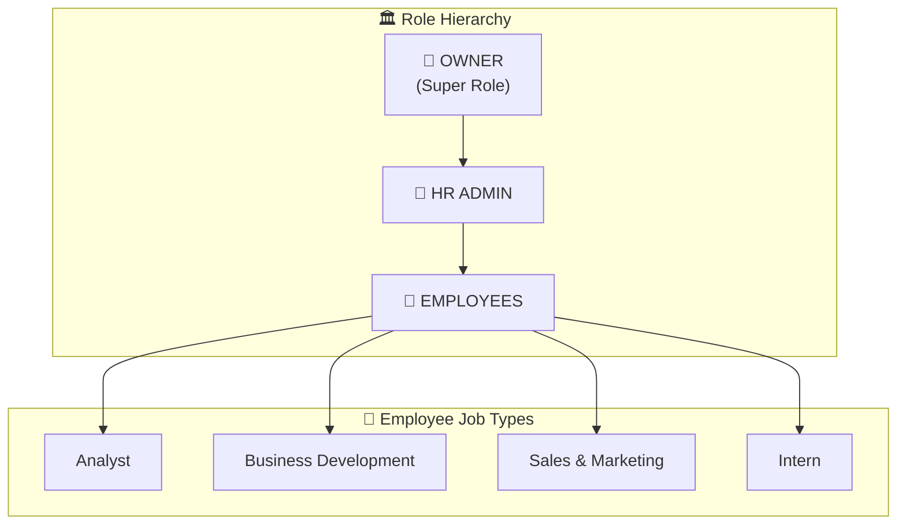
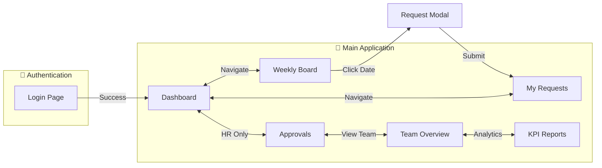
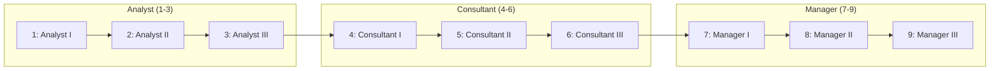
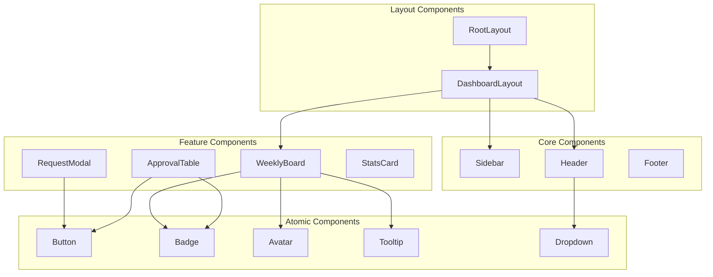

# 🎨 Frontend Implementation Plan: Internal Management System

> **Focus Area:** UI/UX Design, Component Architecture, & Navigation Flow

---

## I. Design Philosophy & Visual Identity

### 1.1 Design Direction: **"Professional Elegance"**

Kita akan membangun UI yang **clean, modern, dan professional** dengan sentuhan dinamis. Inspirasi dari dashboard enterprise-grade seperti Linear, Notion, dan Slack.

| Aspect | Approach |
|--------|----------|
| **Color Scheme** | Dark mode primary + Light mode option |
| **Typography** | Inter (Google Font) - clean & readable |
| **Layout** | Sidebar-fixed + Content area fluid |
| **Visual Style** | Glassmorphism subtle, soft shadows, micro-animations |
| **Accessibility** | WCAG 2.1 AA compliant |

### 1.2 Color Palette (Brand Colors)

```css
/* ===== BRAND COLORS ===== */

/* Base Colors */
--color-dark: #1c2120;        /* Hitam (Dark Mode Background) */
--color-light: #e9e9e9;       /* Putih (Light Mode / Main Website) */

/* Primary Colors */
--primary-accent: #e8c458;    /* Gold - Aksen Utama (CTA, highlights) */
--primary-main: #3f545f;      /* Slate Teal - Warna Utama */

/* Supporting Colors */
--support-brown: #665b4f;     /* Brown/Taupe - Pendukung */
--support-blue: #5f788e;      /* Steel Blue - Pendukung */

/* ===== DERIVED COLORS ===== */

/* Dark Mode (Default) */
--bg-primary: #1c2120;        /* Main background */
--bg-secondary: #252a29;      /* Card background */
--bg-tertiary: #3f545f;       /* Elevated elements */
--text-primary: #e9e9e9;      /* Main text */
--text-secondary: #a0a8a6;    /* Muted text */
--border: #3f545f;            /* Borders */

/* Light Mode */
--bg-primary-light: #e9e9e9;
--bg-secondary-light: #ffffff;
--text-primary-light: #1c2120;
--text-secondary-light: #665b4f;

/* Status Colors (Semantic) */
--status-success: #4ade80;    /* Green - WFO/Approved */
--status-wfh: #5f788e;        /* Steel Blue - WFH */
--status-field: #e8c458;      /* Gold - Field/Dinas */
--status-pending: #e8c458;    /* Gold - Pending */
--status-sick: #f472b6;       /* Pink - Sick */
--status-leave: #a78bfa;      /* Purple - Cuti */
--status-alpha: #ef4444;      /* Red - Alpha/Absent */
```

### 1.3 Attendance Status Visual Mapping

| Status | Color | Icon | Badge Style |
|--------|-------|------|-------------|
| **Office/WFO** | 🟢 Green | `Building` | Solid green circle |
| **WFH** | 🔵 Blue | `Home` | Blue outline circle |
| **Field Assignment** | 🟠 Orange | `Briefcase` | Orange with dot |
| **Pending** | 🟡 Amber | `Clock` | Dashed amber border |
| **Sick** | 🩷 Pink | `Heart` | Pink filled |
| **Leave/Cuti** | 🟣 Purple | `Plane` | Purple filled |
| **Alpha** | 🔴 Red | `X` | Red with strikethrough |

---

## II. Business Rules & Employment Types (UPDATED - 27 Dec 2024)

> [!IMPORTANT]
> Section ini berisi aturan bisnis yang harus diimplementasikan baik di frontend maupun backend.
> Lihat `implementation_plan_backend.md` untuk detail schema Supabase.

### 2.0.1 Employment Types (Status Kontrak)

| Code | Nama | Deskripsi |
|------|------|-----------|
| **PKWTT** | Karyawan Tetap | Perjanjian Kerja Waktu Tidak Tertentu |
| **PKWT** | Karyawan Kontrak | Perjanjian Kerja Waktu Tertentu |
| **Intern** | Magang | Program magang (3-6 bulan) |

### 2.0.2 Entitlements by Employment Type

| Benefit | PKWTT | PKWT | Intern |
|---------|:-----:|:----:|:------:|
| **WFH** | 1x/minggu | 1x/minggu | 2x/minggu |
| **WFA** | 30 hari/tahun | ❌ | ❌ |
| **Cuti** | 15 hari/tahun | 1 hari/bulan kerja | ❌ |
| **Check-in/out** | ✅ | ✅ | ✅ |
| **Project Board** | Full access | Full access | View only |
| **CRM Database** | BisDev only | BisDev only | ❌ |

### 2.0.3 Clock In & Clock Out Rules (UPDATED - 29 Dec 2024)

> [!NOTE]
> **Terminologi diubah dari "Check-in/Check-out" menjadi "Clock In/Clock Out" untuk lebih jelas.**

```
┌─────────────────────────────────────────────────────────────────────────┐
│                         CLOCK IN/OUT RULES                              │
├─────────────────────────────────────────────────────────────────────────┤
│                                                                         │
│  ⏰ CLOCK IN WINDOW                                                     │
│  ┌─────────────────────────────────────────────────────────────────┐   │
│  │  Start:  07:45 WIB                                              │   │
│  │  Batas:  08:30 WIB  ← Lebih dari ini = LATE                     │   │
│  └─────────────────────────────────────────────────────────────────┘   │
│                                                                         │
│  ⏰ CLOCK OUT WINDOW                                                    │
│  ┌─────────────────────────────────────────────────────────────────┐   │
│  │  Start:  17:00 WIB  ← Minimal jam pulang                        │   │
│  └─────────────────────────────────────────────────────────────────┘   │
│                                                                         │
│  📋 STATUS & CLOCK IN/OUT REQUIREMENT                                   │
│  ┌─────────────────────────────────────────────────────────────────┐   │
│  │ Status       │ Clock In │ Clock Out │ Pre-approval │ Late?     │   │
│  ├──────────────┼──────────┼───────────┼──────────────┼───────────┤   │
│  │ WFO (Office) │    ✅    │    ✅     │      ❌      │    Ya     │   │
│  │ WFH          │    ✅    │    ✅     │   ✅ (lock)  │    Ya     │   │
│  │ WFA          │    ✅    │    ✅     │   ✅ (lock)  │    Ya     │   │
│  │ Field/Dinas  │    ✅    │    ✅     │   Optional   │    ❌     │   │
│  │ Sick/Sakit   │    ❌    │    ❌     │ ✅ atau same-day│  ❌     │   │
│  │ Leave/Cuti   │    ❌    │    ❌     │      ✅      │    ❌     │   │
│  └─────────────────────────────────────────────────────────────────┘   │
│                                                                         │
│  🖥️ HERO SECTION DISPLAY (Dashboard Home)                              │
│  ┌─────────────────────────────────────────────────────────────────┐   │
│  │ SETELAH CLOCK IN:                                               │   │
│  │ • Badge: "Online" + "Work Status" (WFH/WFO/WFA/etc)            │   │
│  │ • 🟢 Clock In: [TIME] + "Clock Out" button                     │   │
│  │ • Dynamic feedback message (praise/reminder)                    │   │
│  │ • WFH/WFA: Extra reminder "Jangan anggurin HP > 30 menit"      │   │
│  │                                                                  │   │
│  │ SETELAH CLOCK OUT:                                              │   │
│  │ • 🟢 Clock In: [TIME] + 🔴 Clock Out: [TIME]                   │   │
│  │ • Dynamic goodbye message                                       │   │
│  │                                                                  │   │
│  │ HISTORY TRACKING (Backend):                                     │   │
│  │ • Semua clock in/out times disimpan di daily_checkins table    │   │
│  │ • User bisa lihat history di profile/attendance page           │   │
│  │ • Owner bisa lihat semua employee history                      │   │
│  └─────────────────────────────────────────────────────────────────┘   │
│                                                                         │
│  ⚠️ SPECIAL CASES                                                       │
│  • Field/Dinas: Bisa clock in jam berapa pun (sibuk di lapangan)       │
│  • Force Majeure: Sakit/Izin di hari yang sama → tidak dianggap late   │
│  • Approved Request: Status auto-lock, tapi tetap wajib isi To-Do      │
│                                                                         │
└─────────────────────────────────────────────────────────────────────────┘
```

### 2.0.3.1 Smart Check-in Logic (NEW - 29 Dec 2024)

> [!IMPORTANT]
> **Fitur ini membuat check-in lebih cerdas berdasarkan izin/request yang sudah diajukan sebelumnya.**

```
┌─────────────────────────────────────────────────────────────────────────┐
│                      SMART CHECK-IN AUTO-FILL                           │
├─────────────────────────────────────────────────────────────────────────┤
│                                                                         │
│  🔐 STATUS LOCKING (Berdasarkan Approved Request)                       │
│  ┌─────────────────────────────────────────────────────────────────┐   │
│  │ Kondisi                         │ Behavior saat Check-in       │   │
│  ├─────────────────────────────────┼──────────────────────────────┤   │
│  │ Approved WFH hari ini           │ Status locked ke WFH only    │   │
│  │ Approved WFA hari ini           │ Status locked ke WFA only    │   │
│  │ Approved Sick hari ini          │ AUTO-FILL, tidak perlu absen │   │
│  │ Approved Leave hari ini         │ AUTO-FILL, tidak perlu absen │   │
│  │ Approved Business Trip hari ini │ AUTO-FILL, tidak perlu absen │   │
│  │ Tidak ada approval              │ Bisa pilih WFO/Field bebas   │   │
│  └─────────────────────────────────────────────────────────────────┘   │
│                                                                         │
│  📋 ALASAN AUTO-FILL untuk Sick/Leave/Business Trip:                    │
│  • Orang sakit tidak perlu repot buka laptop untuk absen               │
│  • Orang cuti seharusnya tidak perlu memikirkan kerjaan               │
│  • Orang business trip di lapangan sibuk dan mungkin tidak ada akses  │
│                                                                         │
│  🔄 FLOW LOGIC                                                          │
│  ┌─────────────────────────────────────────────────────────────────┐   │
│  │ 1. Sistem cek: Ada approved request untuk hari ini?             │   │
│  │    ├── YES (sick/leave/business trip) → Auto-fill checkin       │   │
│  │    ├── YES (WFH/WFA) → Lock status, user tetap check-in manual  │   │
│  │    └── NO → User pilih status bebas (WFO, Field, etc)           │   │
│  │                                                                  │   │
│  │ 2. Hero section di dashboard menampilkan:                       │   │
│  │    • Status kerja hari ini (dinamis)                            │   │
│  │    • Sudah check-in atau belum                                  │   │
│  │    • Jam check-in jika sudah                                    │   │
│  └─────────────────────────────────────────────────────────────────┘   │
│                                                                         │
│  ⚠️ NOTES                                                               │
│  • Request harus APPROVED sebelum tanggal berlaku                      │
│  • Untuk sick darurat (hari yang sama), perlu flow tersendiri         │
│  • Auto-fill tetap membuat record di daily_checkins untuk tracking    │
│                                                                         │
└─────────────────────────────────────────────────────────────────────────┘
```

### 2.0.3.2 Dynamic Check-in Feedback Messages (NEW - 29 Dec 2024)

> [!TIP]
> **Pesan interaktif yang muncul setelah check-in untuk meningkatkan engagement dan memberikan feedback yang relevan berdasarkan konteks.**

```
┌─────────────────────────────────────────────────────────────────────────┐
│              DYNAMIC FEEDBACK MESSAGES AFTER CHECK-IN                   │
├─────────────────────────────────────────────────────────────────────────┤
│                                                                         │
│  🏢 SKENARIO 1: CHECK-IN DI KANTOR (WFO)                                │
│  ┌─────────────────────────────────────────────────────────────────┐   │
│  │ ✅ TEPAT WAKTU (≤ 08:30):                                       │   │
│  │    • "Mantap! Kamu datang tepat waktu hari ini! 🎯"             │   │
│  │    • "Good job! Semangat kerja hari ini! 💪"                    │   │
│  │    • "Pagi yang produktif dimulai dari tepat waktu! ☀️"         │   │
│  │                                                                  │   │
│  │ ⚠️ TERLAMBAT (> 08:30):                                         │   │
│  │    • "Oops, telat ya hari ini. Yuk besok lebih pagi! 😅"        │   │
│  │    • "Tidak apa-apa, yang penting sekarang sudah hadir! 💪"     │   │
│  │    • "Semoga macetnya tidak terlalu menyebalkan 🚗"             │   │
│  └─────────────────────────────────────────────────────────────────┘   │
│                                                                         │
│  🏠 SKENARIO 2: CHECK-IN WFH                                            │
│  ┌─────────────────────────────────────────────────────────────────┐   │
│  │ ✅ TEPAT WAKTU (≤ 08:30):                                       │   │
│  │    • "Nice! WFH tapi tetap on-time, mantap! 🏠✨"               │   │
│  │    • "Sudah siap kerja dari rumah! Jangan lupa bisa           │   │
│  │       dihubungi ya, jangan anggurin HP lebih dari 30 menit 📱" │   │
│  │    • "WFH mode ON! Pastikan tetap produktif ya! 💻"             │   │
│  │                                                                  │   │
│  │ ⚠️ TERLAMBAT (> 08:30):                                         │   │
│  │    • "Hayo ngaku, tadi snooze alarm berapa kali? 😴💤"          │   │
│  │    • "Jangan tidur lagi ya! Kasurnya menggoda memang 🛏️"       │   │
│  │    • "Oke sudah check-in, sekarang jangan hibernasi lagi 😄"   │   │
│  │                                                                  │   │
│  │ 📱 REMINDER SELALU MUNCUL UNTUK WFH:                            │   │
│  │    "Ingat: Pastikan HP selalu aktif dan mudah dihubungi.       │   │
│  │     Jangan diemin chat/call lebih dari 30 menit ya! 📞"        │   │
│  └─────────────────────────────────────────────────────────────────┘   │
│                                                                         │
│  🏥 SKENARIO 3: SAKIT (Pre-approved)                                    │
│  ┌─────────────────────────────────────────────────────────────────┐   │
│  │ User membuka dashboard padahal sudah izin sakit:                │   │
│  │                                                                  │   │
│  │    "Eh, ngapain buka ini? 😅                                    │   │
│  │     Tenang, ga perlu absen kok. Kamu sudah tercatat izin sakit.│   │
│  │     Istirahatlah yang cukup ya! Get well soon! 💚🩹"            │   │
│  └─────────────────────────────────────────────────────────────────┘   │
│                                                                         │
│  📅 SKENARIO 4: IZIN/CUTI (Pre-approved)                                │
│  ┌─────────────────────────────────────────────────────────────────┐   │
│  │ User membuka dashboard padahal sudah izin/cuti:                 │   │
│  │                                                                  │   │
│  │    "Kamu lagi izin/cuti loh! 🏖️                                 │   │
│  │     Ga perlu absen, santai aja. Status kamu sudah tercatat.    │   │
│  │     Semoga urusannya cepat selesai ya! 🙌"                      │   │
│  └─────────────────────────────────────────────────────────────────┘   │
│                                                                         │
│  ⚡ SKENARIO 5: FORCE MAJEURE - SAKIT MENDADAK (Same-day sick)          │
│  ┌─────────────────────────────────────────────────────────────────┐   │
│  │ User lapor sakit di hari yang sama:                             │   │
│  │                                                                  │   │
│  │    "Waduh, sakit ya? 😢                                         │   │
│  │     Semoga lekas pulih! Get well soon! 💪🩹                     │   │
│  │     Fokus istirahat dulu, kerjaan bisa ditangani nanti."        │   │
│  └─────────────────────────────────────────────────────────────────┘   │
│                                                                         │
│  ⚡ SKENARIO 6: FORCE MAJEURE - IZIN MENDADAK (Same-day leave)          │
│  ┌─────────────────────────────────────────────────────────────────┐   │
│  │ User izin mendadak di hari yang sama:                           │   │
│  │                                                                  │   │
│  │    "Izin mendadak ya? Tidak apa-apa! 🙏                         │   │
│  │     Semoga urusannya bisa cepat selesai.                        │   │
│  │     Take care dan kabari kalau sudah beres ya!"                 │   │
│  └─────────────────────────────────────────────────────────────────┘   │
│                                                                         │
│  🚗 SKENARIO 7: DINAS/BUSINESS TRIP                                     │
│  ┌─────────────────────────────────────────────────────────────────┐   │
│  │ User sedang dinas lapangan:                                     │   │
│  │                                                                  │   │
│  │    "Semangat di lapangan! 💼🚗                                  │   │
│  │     Hati-hati di jalan dan sukses dengan tugasnya ya!"          │   │
│  └─────────────────────────────────────────────────────────────────┘   │
│                                                                         │
│  📋 IMPLEMENTATION NOTES:                                               │
│  • Pesan dipilih secara random dari pool untuk variasi                 │
│  • Pesan ditampilkan di hero section setelah check-in                  │
│  • Untuk pre-approved sick/leave, tampilkan saat user buka dashboard   │
│  • Tone: Friendly, menghibur, tidak menggurui                          │
│                                                                         │
└─────────────────────────────────────────────────────────────────────────┘
```

### 2.0.4 Daily To-Do (Task) System

```
┌─────────────────────────────────────────────────────────────────────────┐
│                         TASK CARRY-OVER SYSTEM                          │
├─────────────────────────────────────────────────────────────────────────┤
│                                                                         │
│  📋 RULES                                                               │
│  1. Task yang BELUM SELESAI akan otomatis carry ke hari berikutnya     │
│  2. Task bisa di-carry unlimited sampai user menyelesaikannya          │
│  3. Sistem track berapa kali task di-carry (carried_count)             │
│  4. Dari sini bisa dilihat berapa lama task diselesaikan               │
│                                                                         │
│  📅 EXAMPLE FLOW                                                        │
│  ┌─────────────────────────────────────────────────────────────────┐   │
│  │ Hari 1 (Senin):    Task A ✅, Task B ⬜, Task C ⬜              │   │
│  │ Hari 2 (Selasa):   Task B ⬜ (carry 1x), Task C ✅, Task D ⬜   │   │
│  │ Hari 3 (Rabu):     Task B ⬜ (carry 2x), Task D ⬜, Task E ⬜   │   │
│  │ Hari 4 (Kamis):    Task B ✅ (selesai! took 4 days)            │   │
│  └─────────────────────────────────────────────────────────────────┘   │
│                                                                         │
│  📊 TRACKING METRICS                                                    │
│  • created_date: Tanggal task dibuat                                   │
│  • completed_at: Timestamp saat diselesaikan                            │
│  • carried_count: Berapa kali di-carry ke hari berikutnya              │
│  • Duration = completed_at - created_date                               │
│                                                                         │
└─────────────────────────────────────────────────────────────────────────┘
```

### 2.0.5 Approval Flow (UPDATED)

> [!IMPORTANT]
> **ONLY Owner dapat approve/reject request.**
> HR dapat melihat semua request tapi tidak bisa approve.

```
┌─────────────────────────────────────────────────────────────────────────┐
│                         APPROVAL FLOW                                   │
├─────────────────────────────────────────────────────────────────────────┤
│                                                                         │
│  👤 EMPLOYEE                                                            │
│  └──▶ Submit Request (WFH/WFA/Sick/Leave)                              │
│                              │                                          │
│                              ▼                                          │
│  ┌─────────────────────────────────────────────────────────────────┐   │
│  │  📧 NOTIFICATIONS                                               │   │
│  │                                                                  │   │
│  │  👑 Owner:                                                       │   │
│  │  • In-app notification ✅                                        │   │
│  │  • Email via Resend ✅ (Action Required)                        │   │
│  │                                                                  │   │
│  │  🔐 HR Admin:                                                    │   │
│  │  • In-app notification ✅                                        │   │
│  │  • Email ❌ (viewer only)                                        │   │
│  └─────────────────────────────────────────────────────────────────┘   │
│                              │                                          │
│                              ▼                                          │
│  👑 OWNER ONLY                                                          │
│  └──▶ Approve ✅ / Reject ❌                                           │
│                              │                                          │
│                              ▼                                          │
│  👤 EMPLOYEE                                                            │
│  └──▶ Dapat notification hasil (approved/rejected)                      │
│                                                                         │
└─────────────────────────────────────────────────────────────────────────┘
```

### 2.0.6 Frontend Changes Required

| Component | Changes Needed |
|-----------|----------------|
| **Profile Settings** | Add employment_type display (PKWTT/PKWT/Intern) |
| **Check-in Page** | Time validation (07:45-08:30), late detection |
| **Dashboard To-Do** | Show carried tasks with badge, filter by date |
| **Leave Request** | Calculate quota based on employment_type |
| **WFH Request** | Validate weekly quota (1x or 2x for intern) |
| **WFA Request** | Only show for PKWTT users |
| **Approval Page** | Only Owner can see approve/reject buttons |
| **HR View** | HR can see requests but read-only |

---

## III. Navigation Architecture

### 3.1 Role Hierarchy



### 2.2 Access Control Matrix

| Feature | Owner | HR Admin | Analyst | BisDev | Sales | Intern |
|---------|:-----:|:--------:|:-------:|:------:|:-----:|:------:|
| Dashboard & Check-in | ✅ | ✅ | ✅ | ✅ | ✅ | ✅ |
| Weekly Board | ✅ | ✅ | ✅ | ✅ | ✅ | ✅ |
| My Requests | ✅ | ✅ | ✅ | ✅ | ✅ | ✅ |
| Project Board | ✅ | ✅ | ✅ | ✅ | ✅ | 👁️ |
| Career Milestone | ✅ | ✅ | ✅ | ✅ | ✅ | ✅ |
| **CRM Database** | ✅ | ❌ | ❌ | ✅ | ❌ | ❌ |
| Approvals | ✅ | ✅ | ❌ | ❌ | ❌ | ❌ |
| Team Daily Reports | ✅ | ✅ | ❌ | ❌ | ❌ | ❌ |
| KPI Reports | ✅ | ✅ | ❌ | ❌ | ❌ | ❌ |
| User Management | ✅ | ✅ | ❌ | ❌ | ❌ | ❌ |
| System Settings | ✅ | ❌ | ❌ | ❌ | ❌ | ❌ |
| Role Assignment | ✅ | ❌ | ❌ | ❌ | ❌ | ❌ |

> 👁️ = View only, ✅ = Full access, ❌ = No access
>
> ⚠️ **Note:** CRM Database hanya untuk Owner & BisDev, HR Admin tidak memiliki akses.

### 2.3 Job Type Specific Features

| Job Type | Special Features |
|----------|------------------|
| **Analyst** | Project assignments, audit tasks, document review |
| **Business Development** | **CRM Database access**, client management, leads |
| **Sales & Marketing** | Marketing tasks (CRM view TBD) |
| **Intern** | Limited project view, mentorship tracking |

### 3.4 Sidebar Navigation Structure (UPDATED - 27 Dec 2024)

> [!NOTE]
> Struktur ini sesuai dengan `src/components/layout/Sidebar.tsx` terbaru.

```text
┌─────────────────────────────────────┐
│  [WSC LOGO]                         │  ← Company Logo
├─────────────────────────────────────┤
│                                     │
│  🏠 Home                            │  ← /dashboard
│  ⏰ Check-in                        │  ← /dashboard/checkin
│  📋 Leave Requests                  │  ← /dashboard/leave-requests
│  📅 Weekly Board                    │  ← /dashboard/board
│  � Project Board                   │  ← /dashboard/projects
│  � Team Directory                  │  ← /dashboard/directory
│                                     │
├─────────────────────────────────────┤
│  💼 BUSINESS                        │  ← Section (BisDev + Owner only)
│  � BisDev Dashboard                │  ← /dashboard/bisdev
│  �🗃️  CRM Database                   │  ← /dashboard/crm
│                                     │
├─────────────────────────────────────┤
│  🔐 HR ADMIN                        │  ← Section (HR + Owner only)
│  ✅ Request Approval        [2]     │  ← /dashboard/request-approval
│  👥 Team Reports                    │  ← /dashboard/team
│  � KPI Reports                     │  ← /dashboard/kpi
│  🏢 Company KPI                     │  ← /dashboard/company-kpi
│  👤 User Management                 │  ← /dashboard/users
│                                     │
├─────────────────────────────────────┤
│  👑 OWNER ONLY                      │  ← Section (Owner only)
│  ⚙️  Settings                       │  ← /dashboard/settings
│                                     │
├─────────────────────────────────────┤
│  📚 RESOURCES                       │  ← Section (All Users)
│  📄 SOP Database                    │  ← /dashboard/sop
│  ❓ Knowledge Hub                   │  ← /dashboard/knowledge
│  🎓 Training Request                │  ← /dashboard/training
│                                     │
├─────────────────────────────────────┤
│  🌍 SUSTAINABILITY                  │  ← Section (All Users)
│  🌱 Sustainability                  │  ← /dashboard/sustainability
│  ✈️  Travel Report                  │  ← /dashboard/sustainability/travel
│  🗑️  Waste Report                   │  ← /dashboard/sustainability/waste
│                                     │
├─────────────────────────────────────┤
│  � OPERASIONAL                     │  ← Section (All Users)
│  📦 Asset Management                │  ← /dashboard/operational/asset-management
│  💵 Petty Cash                      │  ← /dashboard/operational/petty-cash
│  📝 Asset Request                   │  ← /dashboard/operational/asset-request
│                                     │
├─────────────────────────────────────┤
│  🚪 Log Out                         │  ← All Users
└─────────────────────────────────────┘
```

### 3.5 Complete Route Map

| Route | Page | Access | Status |
|-------|------|--------|--------|
| `/dashboard` | Home Dashboard | All | ✅ Implemented |
| `/dashboard/checkin` | Daily Check-in | All | ✅ Implemented |
| `/dashboard/leave-requests` | Leave Request Form | All | ✅ Implemented |
| `/dashboard/board` | Weekly Board | All | ✅ Implemented |
| `/dashboard/projects` | Project Board | All (Intern: view) | ✅ Implemented |
| `/dashboard/directory` | Team Directory | All | ✅ Implemented |
| `/dashboard/bisdev` | BisDev Dashboard | Owner, BisDev | ✅ Implemented |
| `/dashboard/crm` | CRM Database | Owner, BisDev | ✅ Implemented |
| `/dashboard/request-approval` | Approval Page | Owner, HR | ✅ Implemented |
| `/dashboard/team` | Team Reports | Owner, HR | ✅ Implemented |
| `/dashboard/kpi` | KPI Reports | Owner, HR | ✅ Implemented |
| `/dashboard/company-kpi` | Company KPI | Owner, HR | ✅ Implemented |
| `/dashboard/users` | User Management | Owner, HR | ✅ Implemented |
| `/dashboard/settings` | System Settings | Owner | ✅ Implemented |
| `/dashboard/sop` | SOP Database | All | ✅ Implemented |
| `/dashboard/knowledge` | Knowledge Hub | All | ✅ Implemented |
| `/dashboard/training` | Training Request | All | ✅ Implemented |
| `/dashboard/sustainability` | Sustainability | All | ✅ Implemented |
| `/dashboard/sustainability/travel` | Travel Report | All | ✅ Implemented |
| `/dashboard/sustainability/waste` | Waste Report | All | ✅ Implemented |
| `/dashboard/operational` | Operational Home | All | ✅ Implemented |
| `/dashboard/operational/asset-management` | Asset Management | All | ✅ Implemented |
| `/dashboard/operational/petty-cash` | Petty Cash | All | ✅ Implemented |
| `/dashboard/operational/asset-request` | Asset Request | All | ✅ Implemented |

### 2.3 Navigation Flow Diagram



---

## III. Page-by-Page UI Specification

### 3.1 Login Page (`/login`)

#### Layout
```text
┌─────────────────────────────────────────────────────────┐
│                                                         │
│                    [Hero Gradient BG]                   │
│                                                         │
│              ┌─────────────────────────┐                │
│              │     🏢 HRIS Center      │                │
│              │                         │                │
│              │  ┌───────────────────┐  │                │
│              │  │ 📧 Email          │  │                │
│              │  └───────────────────┘  │                │
│              │  ┌───────────────────┐  │                │
│              │  │ 🔒 Password       │  │                │
│              │  └───────────────────┘  │                │
│              │                         │                │
│              │  [  Sign In Button  ]   │                │
│              │                         │                │
│              │  ──────── atau ───────  │                │
│              │                         │                │
│              │  [G] Sign in with Google│                │
│              │                         │                │
│              └─────────────────────────┘                │
│                                                         │
└─────────────────────────────────────────────────────────┘
```

> [!NOTE]
> **Authentication Options (via Supabase Auth):**
> - Email + Password (default)
> - **Google OAuth** ✅ (Supabase supports this natively)
> - Magic Link (optional, via email)

#### Visual Details
- **Background:** Animated gradient mesh (brand colors)
- **Card:** Glassmorphism effect with subtle blur
- **Inputs:** Rounded, with floating labels
- **Button:** Gradient primary with hover glow effect
- **Google Button:** White bg with Google logo

---

### 3.2 Dashboard Home (`/dashboard`) - UPDATED 27 Dec 2024

> [!IMPORTANT]
> Layout baru dengan Announcement Card dan Today's Team Status.
> Career Milestone dipindahkan ke bawah. Weekly Board preview dihapus.

#### Layout - Desktop (1440px+)
```text
┌──────────┬─────────────────────────────────────────────────────────────┐
│          │  Header: Greeting + Date + Profile                         │
│          ├─────────────────────────────────────────────────────────────┤
│          │                                                             │
│          │  ┌─ DAILY CHECK-IN (Hero) ───────────────────────────────┐ │
│          │  │  📍 Hari ini kamu kerja dari mana?                    │ │
│ SIDEBAR  │  │                                                        │ │
│          │  │  ┌─────────┐ ┌─────────┐ ┌─────────┐ ┌─────────┐      │ │
│  (240px) │  │  │ 🏢      │ │ 🏠      │ │ 🚗      │ │ 🏥      │      │ │
│          │  │  │ Kantor  │ │ WFH     │ │ Dinas   │ │ Sakit   │      │ │
│          │  │  └─────────┘ └─────────┘ └─────────┘ └─────────┘      │ │
│          │  │                                                        │ │
│          │  │  ✅ Status: Sudah check-in pukul 08:45               │ │
│          │  └────────────────────────────────────────────────────────┘ │
│          │                                                             │
│          │  ┌─ 📢 Announcement (Owner) ──┐ ┌─ 👥 Today's Team ──────┐ │
│          │  │                            │ │                        │ │
│          │  │  🔔 PENTING!               │ │  📅 Jumat, 27 Des 2024 │ │
│          │  │  Weekly meeting diundur    │ │                        │ │
│          │  │  ke jam 15:00.             │ │  🟢 Office: 8 orang    │ │
│          │  │                            │ │  🔵 WFH: 3 orang       │ │
│          │  │  📅 27 Des 2024, 08:00     │ │  🚗 Dinas: 2 orang     │ │
│          │  │  By: Pak Bos (Owner)       │ │  🩷 Sakit: 1 orang     │ │
│          │  │                            │ │  🟣 Cuti: 2 orang      │ │
│          │  │  ────────────────────────  │ │                        │ │
│          │  │                            │ │  [Lihat Detail →]      │ │
│          │  │  🏖️ Senin 30 Des libur    │ │                        │ │
│          │  │  nasional (Cuti Bersama)   │ └────────────────────────┘ │
│          │  │                            │                            │
│          │  │  📅 26 Des 2024, 17:00     │                            │
│          │  └────────────────────────────┘                            │
│          │                                                             │
│          │  ┌─ 📝 Daily Plan (To-Do) ───────────────────────────────┐ │
│          │  │                                                        │ │
│          │  │  ☐ Finalisasi dokumen audit        [High] PT Maju    │ │
│          │  │  ☐ Meeting client (10:00)          [Med]  PT ABC     │ │
│          │  │  ☐ Review feedback supervisor      [Low]              │ │
│          │  │  ☑ Prepare presentasi ✓            [Med]  Selesai    │ │
│          │  │                                                        │ │
│          │  │  [+ Add Task]                                          │ │
│          │  └────────────────────────────────────────────────────────┘ │
│          │                                                             │
│          │  ┌─ 📊 Project Workload ──────┐ ┌─ ⭐ Career Milestone ──┐ │
│          │  │  Kapasitas: 3/4 Projek     │ │  Analyst Level 2       │ │
│          │  │  ████████░░ 75%            │ │  2 Tahun 3 Bulan       │ │
│          │  │                            │ │                        │ │
│          │  │  • Proj ABC (Active)       │ │  Next: Senior Analyst  │ │
│          │  │  • Proj XYZ (Active)       │ │  ▓▓▓▓▓▓▓░░░ 70%        │ │
│          │  │  • Proj 123 (Review)       │ │  [View Path →]         │ │
│          │  └────────────────────────────┘ └────────────────────────┘ │
│          │                                                             │
└──────────┴─────────────────────────────────────────────────────────────┘
```

#### Component Breakdown (UPDATED)

| Section | Component | Description |
|---------|-----------|-------------|
| Header | `Header.tsx` | Greeting, date, profile dropdown |
| **Daily Check-in** | `DailyCheckin.tsx` | Hero section untuk absensi harian |
| **Announcement** | `AnnouncementCard.tsx` | **[NEW]** Pesan dari Owner untuk semua user |
| **Today's Team** | `TodaysTeamStatus.tsx` | **[NEW]** Siapa saja yang di kantor/WFH/dll hari ini |
| **Daily Plan** | `DailyPlanCard.tsx` | To-do list dengan task carry-over |
| **Project Workload** | `ProjectWorkload.tsx` | Kapasitas & list projek aktif |
| **Career Milestone** | `CareerMilestone.tsx` | Progress karir & tenure (dipindah ke bawah) |

#### Announcement Card Details

```text
┌─ 📢 Announcement ────────────────────────────────────────────────────────┐
│                                                                          │
│  FEATURES:                                                               │
│  • Owner dapat membuat announcement baru                                 │
│  • Multiple announcements dalam 1 card (scroll)                          │
│  • Tampil berdasarkan tanggal (terbaru di atas)                         │
│  • Auto-hide setelah X hari (configurable)                              │
│  • Optional: Pin announcement penting                                    │
│                                                                          │
│  YANG BISA DILIHAT:                                                      │
│  • Semua user melihat announcement                                       │
│  • Hanya Owner yang bisa create/edit/delete                             │
│                                                                          │
│  CONTOH USE CASE:                                                        │
│  • "Weekly meeting diundur ke jam 15:00"                                │
│  • "Besok libur nasional"                                               │
│  • "Reminder: Submit timesheet sebelum Jumat"                           │
│  • "Selamat ulang tahun untuk Budi! 🎂"                                 │
│                                                                          │
└──────────────────────────────────────────────────────────────────────────┘
```

#### Today's Team Status Card Details

```text
┌─ 👥 Today's Team Status ─────────────────────────────────────────────────┐
│                                                                          │
│  FEATURES:                                                               │
│  • Hanya menampilkan data HARI INI                                       │
│  • Summary per status (berapa orang WFO, WFH, dll)                      │
│  • Click untuk expand dan lihat nama-nama                               │
│  • Real-time update saat ada check-in baru                              │
│                                                                          │
│  DISPLAY:                                                                │
│  ┌────────────────────────────────────────────────────────────────────┐ │
│  │  📅 Jumat, 27 Des 2024                                             │ │
│  │                                                                     │ │
│  │  🟢 Office: 8 orang                                                │ │
│  │     Andi, Budi, Citra, Dewi, Eko, Fitri, Gita, Hadi               │ │
│  │                                                                     │ │
│  │  🔵 WFH: 3 orang                                                   │ │
│  │     Indra, Joko, Kartini                                           │ │
│  │                                                                     │ │
│  │  🚗 Dinas/Field: 2 orang                                           │ │
│  │     Lisa (PT ABC), Maya (Surabaya)                                 │ │
│  │                                                                     │ │
│  │  🩷 Sakit: 1 orang                                                 │ │
│  │     Nanda                                                          │ │
│  │                                                                     │ │
│  │  🟣 Cuti: 2 orang                                                  │ │
│  │     Oscar, Putri                                                   │ │
│  │                                                                     │ │
│  │  ⏳ Belum check-in: 1 orang                                        │ │
│  │     Rizky                                                           │ │
│  └────────────────────────────────────────────────────────────────────┘ │
│                                                                          │
└──────────────────────────────────────────────────────────────────────────┘
```

#### Database Schema Addition (for Announcements)

```sql
-- Add to implementation_plan_backend.md
CREATE TABLE public.announcements (
  id uuid NOT NULL DEFAULT gen_random_uuid(),
  
  -- Content
  title text,
  message text NOT NULL,
  
  -- Visibility
  is_pinned boolean DEFAULT false,
  expires_at timestamp with time zone,  -- NULL = never expires
  
  -- Metadata
  created_by uuid NOT NULL REFERENCES public.profiles(id),
  created_at timestamp with time zone DEFAULT now(),
  updated_at timestamp with time zone DEFAULT now(),
  
  CONSTRAINT announcements_pkey PRIMARY KEY (id)
);

-- RLS: All can view, only Owner can create/edit/delete
ALTER TABLE public.announcements ENABLE ROW LEVEL SECURITY;

CREATE POLICY "All users can view announcements"
  ON public.announcements FOR SELECT
  USING (true);

CREATE POLICY "Owner can manage announcements"
  ON public.announcements FOR ALL
  USING (
    EXISTS (
      SELECT 1 FROM public.profiles 
      WHERE id = auth.uid() AND role = 'owner'
    )
  );
```

---

### 3.3 Weekly Board (`/dashboard/board`)

#### The Core Feature - Full Weekly Board

```text
┌──────────────────────────────────────────────────────────────────┐
│  Weekly Board - 16-20 Des 2024                    [◀] [▶] [Today]│
├──────────────────────────────────────────────────────────────────┤
│  Filter: [All Teams ▼] [All Status ▼]        🔍 Search employee  │
├────────┬──────────┬──────────┬──────────┬──────────┬─────────────┤
│  Name  │  Senin   │  Selasa  │  Rabu    │  Kamis   │  Jumat      │
│        │   16     │    17    │   18     │   19     │   20        │
├────────┼──────────┼──────────┼──────────┼──────────┼─────────────┤
│  [👤]  │   🟢     │   🟢     │   🔵     │   🟡     │   🟡        │
│  Andi  │  Office  │  Office  │   WFH    │ Pending  │  Pending    │
├────────┼──────────┼──────────┼──────────┼──────────┼─────────────┤
│  [👤]  │   🩷     │   🩷     │   🩷     │   🟢     │   🟢        │
│  Budi  │  Sick    │  Sick    │  Sick    │  Office  │  Office     │
├────────┼──────────┼──────────┼──────────┼──────────┼─────────────┤
│  [👤]  │   🟣     │   🟣     │   🟣     │   🟣     │   🟣        │
│  Citra │  Cuti    │  Cuti    │  Cuti    │  Cuti    │  Cuti       │
└────────┴──────────┴──────────┴──────────┴──────────┴─────────────┘

Legend: 🟢 Office  🔵 WFH  🟡 Pending  🩷 Sick  🟣 Leave  🔴 Alpha
```

#### Interaction Patterns

1. **Hover on Cell:** 
   - Show tooltip with details (check-in time, reason if WFH)
   
2. **Click on Own Cell (Employee):**
   - Open Request Modal for that date
   
3. **Click on Any Cell (HR Admin):**
   - Show detail popover with Approve/Reject option if Pending

---

### 3.4 Request Modal

#### Modal UI Design

```text
┌──────────────────────────────────────────┐
│  📝 Buat Request                    [X]  │
├──────────────────────────────────────────┤
│                                          │
│  Tipe Request                            │
│  ┌────────┐ ┌────────┐ ┌────────┐        │
│  │  🏠    │ │  ✈️    │ │  🏥    │        │
│  │  WFH   │ │  Cuti  │ │  Sakit │        │
│  └────────┘ └────────┘ └────────┘        │
│                                          │
│  Tanggal                                 │
│  ┌──────────────────────────────────┐    │
│  │ 📅 19 Des 2024 - 20 Des 2024    │    │
│  └──────────────────────────────────┘    │
│                                          │
│  Alasan (Opsional)                       │
│  ┌──────────────────────────────────┐    │
│  │ Perlu fokus untuk deadline...    │    │
│  └──────────────────────────────────┘    │
│                                          │
│        [Cancel]  [Submit Request]        │
│                                          │
└──────────────────────────────────────────┘
```

#### UX Flow
1. Modal slides up with backdrop blur
2. Request type buttons with icon animation on select
3. Date picker with blocked dates (past, weekends, holidays)
4. Real-time validation feedback
5. Submit shows loading state → Success toast

---

### 3.5 Daily Check-in & Reporting (PRIMARY ATTENDANCE SYSTEM)

#### Purpose
HRIS adalah **satu-satunya sumber kebenaran** untuk absensi. Setiap hari karyawan wajib check-in melalui HRIS dengan mengisi status lokasi kerja dan **daily plan** (apa yang akan dikerjakan hari ini).

> [!IMPORTANT]
> **Mesin Absensi (Fingerprint)** = Hanya untuk insight tambahan punctuality trend, bukan source of truth.

#### Architecture Change

```text
SEBELUM (Complex):
┌─────────────────┐     ┌─────────────────┐
│ External App    │ ──► │ HRIS            │  ← Perlu reconciliation
│ (Fingerprint)   │     │ (Requests)      │
└─────────────────┘     └─────────────────┘

SEKARANG (Simple):
┌─────────────────────────────────────────┐
│           HRIS (Single Source)          │
│  • Check-in + Status + Daily Report     │
└─────────────────────────────────────────┘
         │
         ▼ (Optional, insight only)
┌─────────────────┐
│ Fingerprint App │ → Punctuality trend
└─────────────────┘
```

#### Status Options

| Status | Icon | Approval Required? |
|--------|------|-------------------|
| **Kantor** | 🏢 | ❌ No |
| **WFH** | 🏠 | ✅ Yes (pre-approved, 1x/minggu) |
| **WFA** | 🌍 | ✅ Yes (pre-approved, 30 hari/tahun, ⚠️ Intern: tidak ada) |
| **Tugas Lapangan** | 🚗 | ⚠️ Optional (depends on policy) |
| **Sakit** | 🏥 | ✅ Yes (bisa sebelum ATAU sesudah) |
| **Cuti** | ✈️ | ✅ Yes (pre-approved) |

> **WFH vs WFA:**
> - **WFH** = Work From Home (dari rumah, 1x/minggu)
> - **WFA** = Work From Anywhere (bisa dari mana saja, 30 hari/tahun, Intern tidak bisa)
>
> **Sakit:** Bisa diajukan **sebelum** (appointment dokter) atau **sesudah** (emergency).

#### UI Design - Daily Check-in Form

```text
┌─ Daily Check-in ────────────────────────────────────────────────────────┐
│                                                                          │
│  📅 Senin, 23 Desember 2024                         ⏰ 08:32 WIB        │
│                                                                          │
├──────────────────────────────────────────────────────────────────────────┤
│                                                                          │
│  📍 Hari ini kamu kerja dari mana?                                       │
│                                                                          │
│  ┌──────────┐ ┌──────────┐ ┌──────────┐ ┌──────────┐ ┌──────────┐      │
│  │   🏢     │ │   🏠     │ │   🚗     │ │   🏥     │ │   ✈️     │      │
│  │  Kantor  │ │   WFH    │ │  Dinas   │ │  Sakit   │ │  Cuti    │      │
│  │          │ │  ✅ OK   │ │          │ │          │ │          │      │
│  └──────────┘ └──────────┘ └──────────┘ └──────────┘ └──────────┘      │
│                    ↑                                                     │
│         WFH sudah approved (req #1234)                                  │
│                                                                          │
├──────────────────────────────────────────────────────────────────────────┤
│                                                                          │
│  📝 What will you do today? (Daily Plan)                                 │
│                                                                          │
│  ┌────────────────────────────────────────────────────────────────────┐ │
│  │ - Finalisasi dokumen audit Section A                               │ │
│  │ - Meeting dengan klien PT Maju Jaya (10:00)                        │ │
│  │ - Review feedback dari supervisor                                   │ │
│  │                                                                     │ │
│  └────────────────────────────────────────────────────────────────────┘ │
│                                 Min 20 karakter                          │
│                                                                          │
├──────────────────────────────────────────────────────────────────────────┤
│                                                                          │
│                              [✅ Check-in]                               │
│                                                                          │
│  ⚠️ Batas check-in: 09:00 WIB (tersisa 28 menit)                        │
│                                                                          │
└──────────────────────────────────────────────────────────────────────────┘
```

#### UI Design - After Check-in (View Mode)

```text
┌─ Today's Status ────────────────────────────────────────────────────────┐
│                                                                          │
│  ✅ Checked-in                                                           │
│                                                                          │
│  🏠 WFH • 08:32 WIB • Tepat Waktu                                        │
│                                                                          │
│  ┌─ My Daily Plan ────────────────────────────────────────────────────┐ │
│  │ - Finalisasi dokumen audit Section A                               │ │
│  │ - Meeting dengan klien PT Maju Jaya (10:00)                        │ │
│  │ - Review feedback dari supervisor                                   │ │
│  └────────────────────────────────────────────────────────────────────┘ │
│                                                                          │
│  [📝 Update Plan]  [🔄 Change Status]                                   │
│                         ↑                                                │
│                   Hanya bisa 1x dengan alasan                           │
│                                                                          │
└──────────────────────────────────────────────────────────────────────────┘
```

#### Daily Plan - HR Insight View

```text
┌─ Team Daily Reports - 23 Des 2024 ──────────────────────────────────────┐
│                                                                          │
│  Filter: [All Team ▼] [All Status ▼]            📊 Export to Excel     │
│                                                                          │
├──────────────────────────────────────────────────────────────────────────┤
│                                                                          │
│  👤 Andi Pratama          🏠 WFH         ⏰ 08:32                        │
│  ────────────────────────────────────────────────────────────────────   │
│  - Finalisasi dokumen audit Section A                                   │
│  - Meeting dengan klien PT Maju Jaya (10:00)                            │
│  - Review feedback dari supervisor                                       │
│                                                                          │
│  👤 Budi Santoso          🏢 Kantor      ⏰ 08:15                        │
│  ────────────────────────────────────────────────────────────────────   │
│  - Koordinasi intern tim project XYZ                                    │
│  - Prepare presentasi untuk client                                       │
│                                                                          │
│  👤 Citra Dewi            🚗 Dinas       ⏰ 07:45                        │
│  ────────────────────────────────────────────────────────────────────   │
│  - Site visit ke PT ABC Jakarta                                          │
│  - Meeting with stakeholders                                             │
│                                                                          │
│  ⚠️ Belum Check-in (3):                                                  │
│  👤 Dewi, Eko, Fitri                                                     │
│                                                                          │
└──────────────────────────────────────────────────────────────────────────┘
```

#### Data Structure

```javascript
// attendance_logs table
{
  id: uuid,
  user_id: uuid,
  date: date,
  status: 'office' | 'wfh' | 'field' | 'sick' | 'leave',
  check_in_time: timestamp,
  is_late: boolean,
  daily_plan: text,           // NEW: What to do today
  daily_plan_updated_at: timestamp,
  request_id: uuid | null,    // Link to approved request if WFH/Sick/Leave
  created_at: timestamp
}
```

#### Validation Rules

1. **Mandatory Daily Plan**: Minimal 20 karakter
2. **One Check-in Per Day**: Tidak bisa double check-in
3. **Status Change**: Hanya 1x dengan alasan (audit trail)
4. **Late Threshold**: Configurable (default 09:00)
5. **WFH/Leave Validation**: Harus ada approved request

---

### 3.6 Career Milestone Component (NEW)

#### Purpose
Menampilkan perjalanan karir employee: berapa lama di perusahaan, level saat ini, dan progress menuju level berikutnya.

#### UI Design

```text
┌─ Career Milestone ───────────────────────────────────────────────┐
│                                                                   │
│  👤 Andi Pratama                                                  │
│  📈 Analyst Level 2                                               │
│  🗓️  Bergabung: 15 Sep 2022 (2 Tahun 3 Bulan)                     │
│                                                                   │
│  ┌─ Path to Next Level ─────────────────────────────────────────┐│
│  │                                                               ││
│  │  Next: Senior Analyst                                        ││
│  │                                                               ││
│  │  ▓▓▓▓▓▓▓░░░ 70%                                              ││
│  │                                                               ││
│  │  Requirements:                                                ││
│  │  ✅ 2+ tahun pengalaman                                       ││
│  │  ✅ 10+ projek selesai                                        ││
│  │  ⬜ Sertifikasi ISO (dalam progress)                          ││
│  │  ⬜ Lead 3 projek                                             ││
│  │                                                               ││
│  └───────────────────────────────────────────────────────────────┘│
│                                                                   │
│  [View Full Career Path →]                                        │
│                                                                   │
└───────────────────────────────────────────────────────────────────┘
```

#### Career Level Structure (Analyst Track)



| Grade | Job Grade | Job Title | Experience (Year) | Max Projects |
|:-----:|-----------|-----------|-------------------|:------------:|
| **1** | Analyst I | Business/Tourism Analyst | Entry Level | 2 |
| **2** | Analyst II | Business/Tourism Analyst | 2-3 tahun | 3 |
| **3** | Analyst III | Senior Analyst | 4 tahun | 3 |
| **4** | Consultant I | Business/Tourism Consultant | 5 tahun | 4 |
| **5** | Consultant II | Business/Tourism Consultant | 6-7 tahun | 4 |
| **6** | Consultant III | Senior Consultant | 8-10 tahun | 5 |
| **7** | Manager I | Junior Manager | 11-12 tahun | - |
| **8** | Manager II | Manager | 13-14 tahun | - |
| **9** | Manager III | Senior Manager | 15-16 tahun | - |

> **Note:** Intern tidak termasuk dalam grade system (training period)

---

### 3.7 Project Workload Component (NEW)

#### Purpose
Menampilkan kapasitas projek yang sedang ditangani analyst. HR dapat mengatur jumlah projek berdasarkan level jabatan.

#### UI Design

```text
┌─ Project Workload ───────────────────────────────────────────────┐
│                                                                   │
│  📊 Kapasitas Projek                                              │
│                                                                   │
│  ████████░░  3/4 Projek                                          │
│                                                                   │
│  ┌───────────────────────────────────────────────────────────────┐
│  │ • [🟢] Project ABC        Active    Due: 25 Des               │
│  │ • [🟢] Project XYZ        Active    Due: 10 Jan               │
│  │ • [🟡] Project 123        Review    Due: 5 Jan                │
│  │ • [⬜] ─ 1 slot tersedia ─                                    │
│  └───────────────────────────────────────────────────────────────┘
│                                                                   │
│  ⚠️ Kapasitas hampir penuh (75%)                                  │
│                                                                   │
└───────────────────────────────────────────────────────────────────┘
```

#### Project Status Colors
| Status | Color | Description |
|--------|-------|-------------|
| Active | 🟢 Green | Sedang dikerjakan |
| Review | 🟡 Yellow | Menunggu review |
| On Hold | 🔵 Blue | Ditunda sementara |
| Completed | ⬜ Gray | Selesai |

#### Capacity Rules
- Kapasitas max projek ditentukan oleh **Level Jabatan**
- HR dapat override kapasitas untuk kasus tertentu
- Warning muncul jika kapasitas > 80%
- Blocking jika kapasitas = 100% (tidak bisa assign projek baru)

---

### 3.8 Project Board Page (`/dashboard/projects`) - NEW

#### Purpose
Halaman kanban-style untuk melihat semua projek yang sedang berjalan. Menampilkan dengan jelas siapa **Owner** dan siapa yang **membantu sementara**.

#### Visual Concept

```text
┌──────────────────────────────────────────────────────────────────────────────┐
│  📋 Project Board                                [+ New Project] [Filter ▼]  │
├──────────────────────────────────────────────────────────────────────────────┤
│                                                                              │
│  ┌─ PROJECT CARD ────────────────────────────────────────────────────────┐   │
│  │                                                                        │   │
│  │  📁 Project ABC - Audit PT Maju Jaya                                  │   │
│  │  Status: 🟢 Active     Due: 25 Des 2024     Progress: ▓▓▓▓▓▓░░ 75%   │   │
│  │                                                                        │   │
│  │  ┌─ Team ─────────────────────────────────────────────────────────┐   │   │
│  │  │                                                                 │   │   │
│  │  │  👑 PROJECT LEAD                                                │   │   │
│  │  │  ┌──────┐                                                       │   │   │
│  │  │  │ 👤   │ Andi Pratama                                         │   │   │
│  │  │  │ ⭐   │ Sejak: 1 Nov 2024                                    │   │   │
│  │  │  └──────┘                                                       │   │   │
│  │  │                                                                 │   │   │
│  │  │  👥 TEAM MEMBERS                                                │   │   │
│  │  │  ┌──────┐ ┌──────┐ ┌──────┐                                     │   │   │
│  │  │  │ 👤   │ │ 👤   │ │ 👤   │                                     │   │   │
│  │  │  │Dewi  │ │Eko   │ │Fitri │                                     │   │   │
│  │  │  └──────┘ └──────┘ └──────┘                                     │   │   │
│  │  │                                                                 │   │   │
│  │  │  🤝 HELPER (Temporary)                                          │   │   │
│  │  │  ┌──────┐ ┌──────┐                                              │   │   │
│  │  │  │ 👤   │ │ 👤   │                                              │   │   │
│  │  │  │ Budi │ │ Gita │                                              │   │   │
│  │  │  │10-24 │ │15-20 │  <- Tanggal terlibat                         │   │   │
│  │  │  │ Des  │ │ Des  │                                              │   │   │
│  │  │  └──────┘ └──────┘                                              │   │   │
│  │  │                                                                 │   │   │
│  │  └─────────────────────────────────────────────────────────────────┘   │   │
│  │                                                                        │   │
│  │  [View Details]  [Add Member +]  [Add Helper +]  [Timeline →]         │   │
│  │                                                                        │   │
│  └────────────────────────────────────────────────────────────────────────┘   │
│                                                                              │
└──────────────────────────────────────────────────────────────────────────────┘
```

#### Team Role Types

| Role | Icon | Description | Impact on Capacity |
|------|------|-------------|-------------------|
| **Lead** | 👑⭐ | Penanggung jawab utama project | +1.0 slot |
| **Member** | 👥 | Anggota tim tetap project | +1.0 slot |
| **Helper** | 🤝 | Bantuan sementara (1-4 minggu) | +0.5 slot |
| **Reviewer** | 👁️ | Hanya review, tidak hands-on | +0.0 slot |

#### Helper Assignment Modal

```text
┌─ Add Helper to Project ──────────────────────────────┐
│                                                       │
│  Project: Audit PT Maju Jaya                          │
│                                                       │
│  Pilih Analyst:                                       │
│  ┌───────────────────────────────────────────────┐   │
│  │ 🔍 Search by name...                          │   │
│  └───────────────────────────────────────────────┘   │
│                                                       │
│  ┌─────────────────────────────────────────────────┐ │
│  │ 👤 Budi Santoso                                 │ │
│  │    Analyst Lvl 2 • Kapasitas: 2/3              │ │
│  │    ✅ Available                                 │ │
│  ├─────────────────────────────────────────────────┤ │
│  │ 👤 Citra Dewi                                   │ │
│  │    Senior Analyst • Kapasitas: 3/4             │ │
│  │    ⚠️ Almost full                               │ │
│  └─────────────────────────────────────────────────┘ │
│                                                       │
│  Periode Bantuan:                                     │
│  ┌───────────────┐  ┌───────────────┐                │
│  │ 📅 Start Date │  │ 📅 End Date   │                │
│  │ 10 Des 2024   │  │ 24 Des 2024   │                │
│  └───────────────┘  └───────────────┘                │
│                                                       │
│  Task/Fokus Area:                                     │
│  ┌───────────────────────────────────────────────┐   │
│  │ Review dokumen Section A & B                  │   │
│  └───────────────────────────────────────────────┘   │
│                                                       │
│              [Cancel]  [Assign Helper]               │
│                                                       │
└───────────────────────────────────────────────────────┘
```

#### Project Timeline View

```text
┌─ Project Timeline: Audit PT Maju Jaya ───────────────────────────────────────┐
│                                                                               │
│  Nov 2024                    Des 2024                    Jan 2025            │
│  ────────────────────────────────────────────────────────────────            │
│                                                                               │
│  👑 Andi    ████████████████████████████████████████████████████ (Owner)    │
│  🤝 Budi              ████████████████████                       (10-24 Des) │
│  🤝 Citra                    ██████████                          (15-20 Des) │
│                                                                               │
│  Milestones:                                                                  │
│  ⚫─────────⚫─────────🔵─────────⚪─────────⚪                              │
│  Kick-off  Planning  Fieldwork  Review    Handover                          │
│   1 Nov     10 Nov    1 Des     20 Des     5 Jan                             │
│                                                                               │
└───────────────────────────────────────────────────────────────────────────────┘
```

#### Data Structure (Suggested)

```javascript
// project_members table
{
  id: uuid,
  project_id: uuid,
  user_id: uuid,
  role: 'owner' | 'helper' | 'reviewer',
  start_date: date,
  end_date: date | null,  // null = sampai project selesai
  focus_area: text,       // task spesifik untuk helper
  assigned_by: uuid,      // HR yang assign
  created_at: timestamp
}
```

#### Capacity Calculation Logic

```text
User Capacity = SUM of:
  - Projects where role = 'owner' → +1.0 each
  - Projects where role = 'helper' AND within date range → +0.5 each
  - Projects where role = 'reviewer' → +0.0 each
```

---

### 3.9 Approvals Page (`/dashboard/approvals`) - HR Only

```text
┌──────────────────────────────────────────────────────────────────┐
│  ✅ Pending Approvals                              [Mark All ▼]  │
├──────────────────────────────────────────────────────────────────┤
│  🔍 Filter by: [Employee ▼] [Type ▼] [Date Range]               │
├──────────────────────────────────────────────────────────────────┤
│                                                                  │
│  ┌────────────────────────────────────────────────────────────┐  │
│  │ [👤] Andi Pratama                                          │  │
│  │ 🏠 WFH Request • 19-20 Des 2024 • Submitted 2 jam lalu     │  │
│  │ "Perlu fokus untuk deadline project ABC"                   │  │
│  │                                                            │  │
│  │                        [❌ Reject]  [✅ Approve]            │  │
│  └────────────────────────────────────────────────────────────┘  │
│                                                                  │
│  ┌────────────────────────────────────────────────────────────┐  │
│  │ [👤] Dewi Sartika                                          │  │
│  │ ✈️ Cuti Request • 23-27 Des 2024 • Submitted 1 hari lalu   │  │
│  │ "Liburan akhir tahun"                                      │  │
│  │                                                            │  │
│  │                        [❌ Reject]  [✅ Approve]            │  │
│  └────────────────────────────────────────────────────────────┘  │
│                                                                  │
└──────────────────────────────────────────────────────────────────┘
```

#### Approval Card Interactions
- **Approve:** Green pulse animation → Card slides out → Count updates
- **Reject:** Opens mini-modal for rejection reason → Card slides out

---

### 3.9b KPI Reports Page (`/dashboard/kpi`) - HR + Owner

#### Purpose
Melihat dan memantau KPI karyawan berdasarkan 4 kategori utama. KPI berbeda berdasarkan posisi (Analyst, BusDev, Sales).

#### Position Legend
- **A** = Analyst / Consultant
- **B** = BusDev
- **S** = Sales
- **All** = Semua posisi

#### KPI Structure (2025/2026)

##### 📚 Passion for Knowledge

| KPI | Position | Target | How to Measure |
|-----|----------|--------|----------------|
| New Knowledge | A | Job Grade Based | Lead Sharing Session |
| Participate in Training | A | 70% attendance | Internal Training Attendance |

##### 🎯 Passion for Service

| KPI | Position | Target | How to Measure |
|-----|----------|--------|----------------|
| Customer Satisfaction Score | A/B | ≥ 4.5/5.0 | Client Evaluation |
| Quality of Analysis & Recommendation | A | Job Grade Based | Supervisor Evaluation |
| Ketepatan Waktu Project | A | On Time (max 2 wk ext) | Measure against TOR |
| Punctuality | All | ≥ 80% | Attendance (HRIS) |

##### 💼 Passion for Business

| KPI | Position | Target | How to Measure |
|-----|----------|--------|----------------|
| Productivity (Conversion Rate) | A/B | Job Grade Based | Project Goals / Proposal Submitted |
| Sales Target | B/S | Job Grade Based | Cash In Target |
| New Database | B/S | Job Grade Based | New Business Card |
| New Innovation | A/B | Job Grade Based | Approved Program by CEO |

##### 🌱 Passion for People & Environment

| KPI | Position | Target | How to Measure |
|-----|----------|--------|----------------|
| Participate in Sustainability Action | All | Join Action | Documentation |
| Peer Review (Team Work) | All | ≥ 80% average | Internal Survey |

#### UI Design

```text
┌─ KPI Reports ───────────────────────────────────────────────────────────┐
│                                                                          │
│  📊 KPI Dashboard 2025                         📅 Periode: Q4 2024 ▼    │
│                                                                          │
├──────────────────────────────────────────────────────────────────────────┤
│                                                                          │
│  Filter: [All Position ▼] [All Category ▼]     🔍 Search employee...    │
│                                                                          │
├──────────────────────────────────────────────────────────────────────────┤
│                                                                          │
│  ┌─ 📚 Passion for Knowledge ────────────────────────────────────────┐  │
│  │                                                                    │  │
│  │  👤 Andi Pratama (Analyst)                                        │  │
│  │  ├── New Knowledge: 3/4 sessions ████████░░ 75%                   │  │
│  │  └── Training Attendance: 85% ██████████ ✅                       │  │
│  │                                                                    │  │
│  │  👤 Budi Santoso (BusDev)                                         │  │
│  │  └── Training: N/A (not applicable)                               │  │
│  │                                                                    │  │
│  └────────────────────────────────────────────────────────────────────┘  │
│                                                                          │
│  ┌─ 🎯 Passion for Service ──────────────────────────────────────────┐  │
│  │                                                                    │  │
│  │  👤 Andi Pratama (Analyst)                                        │  │
│  │  ├── Customer Satisfaction: 4.7/5.0 ████████████ ✅               │  │
│  │  ├── Quality Score: 4.2/5.0 (Supervisor) ████████░░               │  │
│  │  ├── Project On Time: 90% ██████████ ✅                           │  │
│  │  └── Punctuality: 92% ██████████ ✅                               │  │
│  │                                                                    │  │
│  └────────────────────────────────────────────────────────────────────┘  │
│                                                                          │
│  [Export to Excel]                              [Page 1 of 3]    [▶]    │
│                                                                          │
└──────────────────────────────────────────────────────────────────────────┘
```

#### Data Structure

```javascript
// kpi_scores table
{
  id: uuid,
  user_id: uuid,
  period: text,           // 'Q4-2024'
  category: text,         // 'knowledge' | 'service' | 'business' | 'people'
  kpi_name: text,
  target: number,
  actual: number,
  score_percentage: number,
  measured_by: text,      // Source of measurement
  notes: text,
  updated_by: uuid,
  created_at: timestamp,
  updated_at: timestamp
}
```

---

### 3.9c Company KPI Dashboard (`/dashboard/company-kpi`) - All Staff (Partial Restricted)

#### Purpose
Dashboard untuk melihat KPI perusahaan secara keseluruhan. Beberapa item sensitif hanya bisa dilihat oleh Owner/BOD.

#### Access Control

| Item | All Staff | HR Admin | Owner/BOD |
|------|:---------:|:--------:|:---------:|
| People (general) | ✅ | ✅ | ✅ |
| **Employee Satisfaction Index** | ❌ | ❌ | ✅ |
| Financial (Revenue Growth) | ✅ | ✅ | ✅ |
| **Net Profit Growth** | ❌ | ❌ | ✅ |
| Cost (COGS Rate) | ❌ | ✅ | ✅ |
| Delivery & Quality | ✅ | ✅ | ✅ |
| Productivity | ✅ | ✅ | ✅ |
| Exposure | ✅ | ✅ | ✅ |
| ESG Performance | ✅ | ✅ | ✅ |
| 2026 Priority Program | ✅ | ✅ | ✅ |

#### KPI Categories (Company Level)

##### 👥 People
| Metric | Visibility | Description |
|--------|------------|-------------|
| **Employee Satisfaction Index** | 🔒 Owner | Internal survey score |
| Women Employment Ratio | All | Percentage female employees |
| Number of Employee (by Status) | All | Breakdown by position/status |

##### 💰 Financial
| Metric | Visibility | Description |
|--------|------------|-------------|
| Revenue Growth (YoY) | All | Year-over-year revenue change |
| **Net Profit Growth (YoY)** | 🔒 Owner | Year-over-year profit change |

##### 📊 Cost
| Metric | Visibility | Description |
|--------|------------|-------------|
| COGS Rate (%) | HR + Owner | Cost of goods sold percentage |

##### 🚚 Delivery
| Metric | Visibility | Description |
|--------|------------|-------------|
| Average Customer Satisfaction Score | All | Client evaluation average |

##### ⭐ Quality
| Metric | Visibility | Description |
|--------|------------|-------------|
| Repeat Order | All | Returning client percentage |

##### 📈 Productivity
| Metric | Visibility | Description |
|--------|------------|-------------|
| Sales Target (Cash In) | All | Total cash received |
| Number of Public Trainings Conducted | All | Training events held |
| Number of Participants | All | Training attendees |
| Conversion Rate | All | Proposal to project ratio |

##### 🎤 Exposure
| Metric | Visibility | Description |
|--------|------------|-------------|
| Speaker Invitation | All | External speaking engagements |
| Whitepaper Published | All | Published research/articles |
| Internal Event Conducted | All | Company events held |

##### 🌱 ESG Performance
| Metric | Visibility | Description |
|--------|------------|-------------|
| Emission Total | All | Carbon footprint |
| Energy | All | Energy consumption |
| Social Fund Distributed | All | CSR fund distributed |
| Environmental Fund Distributed | All | Green initiatives fund |
| Social Program with Staff | All | Employee welfare programs |

##### 🎯 2026 Priority Program Checklist
| Program | Status | Description |
|---------|--------|-------------|
| Rebranding | ⬜ | Company rebrand initiative |
| BCORP | ⬜ | B Corporation certification |
| ISO 9001 | ⬜ | Quality management certification |
| HRIS Launched | ⬜ | This system! 🎉 |
| SOP | ⬜ | Standard operating procedures |

#### UI Design

```text
┌─ Company KPI Dashboard ─────────────────────────────────────────────────┐
│                                                                          │
│  🏢 Company Performance 2025              📅 Periode: YTD 2024 ▼        │
│                                                                          │
├──────────────────────────────────────────────────────────────────────────┤
│                                                                          │
│  ┌────────────┐ ┌────────────┐ ┌────────────┐ ┌────────────┐            │
│  │    32      │ │   +15%     │ │   4.6/5    │ │    85%     │            │
│  │ Employees  │ │  Revenue   │ │  Cust Sat  │ │  Repeat    │            │
│  │            │ │   Growth   │ │   Score    │ │   Order    │            │
│  └────────────┘ └────────────┘ └────────────┘ └────────────┘            │
│                                                                          │
├──────────────────────────────────────────────────────────────────────────┤
│                                                                          │
│  ┌─ 👥 People ───────────────────────────────────────────────────────┐  │
│  │                                                                    │  │
│  │  Women Ratio: 45%  █████████░ │  By Status: Analyst(15) BD(5)...  │  │
│  │                                                                    │  │
│  │  🔒 Employee Satisfaction: [Owner Only]                           │  │
│  │                                                                    │  │
│  └────────────────────────────────────────────────────────────────────┘  │
│                                                                          │
│  ┌─ 💰 Financial ────────────────────────────────────────────────────┐  │
│  │                                                                    │  │
│  │  Revenue Growth (YoY): +15% ██████████████░░░░░░                   │  │
│  │  🔒 Net Profit Growth: [Owner Only]                               │  │
│  │                                                                    │  │
│  └────────────────────────────────────────────────────────────────────┘  │
│                                                                          │
│  ┌─ 🎯 2026 Priority Program ────────────────────────────────────────┐  │
│  │                                                                    │  │
│  │  ⬜ Rebranding   ⬜ BCORP   ⬜ ISO 9001   🟡 HRIS   ⬜ SOP        │  │
│  │                                                                    │  │
│  └────────────────────────────────────────────────────────────────────┘  │
│                                                                          │
└──────────────────────────────────────────────────────────────────────────┘
```

> **Note:** Items marked with 🔒 only visible to Owner/BOD when logged in.

---

### 3.10 Punctuality Insights Page (`/dashboard/punctuality`) - HR Only (OPTIONAL)

> [!NOTE]
> Fitur ini **opsional** dan hanya untuk insight tambahan. Source of truth tetap Daily Check-in di HRIS.

#### Purpose
HR dapat mengupload data dari mesin fingerprint untuk melihat **trend keterlambatan** karyawan saat datang ke kantor. Data ini bukan untuk menentukan kehadiran (yang sudah di-handle HRIS), tapi untuk melihat pola punctuality.

#### Use Case
- Melihat siapa yang sering terlambat fingerprint saat ke kantor
- Trend keterlambatan per bulan/kuartal
- Insight untuk performance review

#### UI Design

```text
┌─ Punctuality Insights ──────────────────────────────────────────────────┐
│                                                                          │
│  📊 Analisis Keterlambatan (dari Mesin Fingerprint)                      │
│                                                                          │
│  ⚠️ Data ini hanya untuk insight tambahan, bukan source kehadiran       │
│                                                                          │
├──────────────────────────────────────────────────────────────────────────┤
│                                                                          │
│  📅 Periode: [Desember ▼] [2024 ▼]     [📁 Upload Fingerprint Data]     │
│                                                                          │
├──────────────────────────────────────────────────────────────────────────┤
│                                                                          │
│  📈 Summary                                                              │
│  ┌────────────────┐ ┌────────────────┐ ┌────────────────┐               │
│  │    245         │ │     18         │ │   avg 12 min   │               │
│  │  Total Days    │ │  Late Count    │ │  Avg Lateness  │               │
│  │  (Office Only) │ │   (7.3%)       │ │                │               │
│  └────────────────┘ └────────────────┘ └────────────────┘               │
│                                                                          │
├──────────────────────────────────────────────────────────────────────────┤
│                                                                          │
│  👥 Employees with Most Late (Office Days)                               │
│                                                                          │
│  ┌────────────────────────────────────────────────────────────────────┐ │
│  │ Rank │ Name           │ Office Days │ Late │ Avg Late │ Trend     │ │
│  ├──────┼────────────────┼─────────────┼──────┼──────────┼───────────┤ │
│  │  1   │ Budi Santoso   │     18      │   5  │  15 min  │ ↑ +2      │ │
│  │  2   │ Dewi Sartika   │     20      │   4  │  10 min  │ ↓ -1      │ │
│  │  3   │ Eko Prasetyo   │     15      │   3  │   8 min  │ → 0       │ │
│  └────────────────────────────────────────────────────────────────────┘ │
│                                                                          │
│  💡 Note: Data hanya untuk hari dengan status "Kantor" di HRIS          │
│                                                                          │
└──────────────────────────────────────────────────────────────────────────┘
```

#### Excel Format (Fingerprint Export)

| Column | Type | Description |
|--------|------|-------------|
| `employee_id` | string | ID karyawan |
| `date` | date | Tanggal |
| `clock_in` | time | Jam fingerprint masuk |
| `clock_out` | time | Jam fingerprint keluar (optional) |

#### Logic
1. Import fingerprint data
2. Match dengan HRIS attendance (hanya yang status = `office`)
3. Hitung selisih `clock_in` vs batas jam (default 09:00)
4. Tampilkan trend dan ranking

---

### 3.11 CRM Database Page (`/dashboard/crm`) - BisDev & Owner Only

> [!IMPORTANT]
> Fitur ini **hanya** untuk Owner dan Business Development. HR Admin tidak memiliki akses.

#### Purpose
**Database klien historis** - Tempat menyimpan data semua klien (previous & current). Fokus pada **rekam jejak** dan informasi kontak.

> [!NOTE]
> **Pemisahan:**
> - **CRM Database** = Data klien (siapa, kontak, industri, history)
> - **BisDev Dashboard** = Tracking aktif (proposal, hot leads, pembayaran)

#### UI Design - Client List

```text
┌─ CRM Database ──────────────────────────────────────────────────────────┐
│                                                                          │
│  🗃️ Client & Leads Management                     [+ Add Client]        │
│                                                                          │
├──────────────────────────────────────────────────────────────────────────┤
│                                                                          │
│  Filter: [All Status ▼] [All Industry ▼]     🔍 Search client...        │
│                                                                          │
├──────────────────────────────────────────────────────────────────────────┤
│                                                                          │
│  📊 Pipeline Summary                                                     │
│  ┌────────────┐ ┌────────────┐ ┌────────────┐ ┌────────────┐            │
│  │    12      │ │     5      │ │     3      │ │     8      │            │
│  │   Leads    │ │ Proposal   │ │ Negotiation│ │   Active   │            │
│  │            │ │   Sent     │ │            │ │  Clients   │            │
│  └────────────┘ └────────────┘ └────────────┘ └────────────┘            │
│                                                                          │
├──────────────────────────────────────────────────────────────────────────┤
│                                                                          │
│  ┌────────────────────────────────────────────────────────────────────┐ │
│  │ 🏢 PT Maju Jaya                            Status: 🟢 Active       │ │
│  │    Industry: Manufacturing                 Since: Jan 2023         │ │
│  │    Contact: Budi (budi@majujaya.com)                               │ │
│  │    Last Activity: Project renewal discussion - 2 days ago          │ │
│  │                                          [View] [Edit] [Add Note]  │ │
│  └────────────────────────────────────────────────────────────────────┘ │
│                                                                          │
│  ┌────────────────────────────────────────────────────────────────────┐ │
│  │ 🏢 CV Berkah Sentosa                       Status: 🟡 Proposal     │ │
│  │    Industry: Retail                        Est. Value: Rp 50jt     │ │
│  │    Contact: Dewi (dewi@berkah.co.id)                               │ │
│  │    Next: Follow-up call scheduled - Tomorrow 10:00                 │ │
│  │                                          [View] [Edit] [Add Note]  │ │
│  └────────────────────────────────────────────────────────────────────┘ │
│                                                                          │
│  ┌────────────────────────────────────────────────────────────────────┐ │
│  │ 🏢 PT ABC Corporation                      Status: 🔵 Lead         │ │
│  │    Industry: Finance                       Source: Referral        │ │
│  │    Contact: Eko (eko@abc.co.id)                                    │ │
│  │    Notes: Interested in audit services                             │ │
│  │                                          [View] [Edit] [Add Note]  │ │
│  └────────────────────────────────────────────────────────────────────┘ │
│                                                                          │
└──────────────────────────────────────────────────────────────────────────┘
```

#### Client Status Pipeline

| Status | Color | Description |
|--------|-------|-------------|
| **Lead** | 🔵 Blue | Prospek baru, belum ada komunikasi serius |
| **Contacted** | 🟣 Purple | Sudah ada komunikasi awal |
| **Proposal** | 🟡 Yellow | Proposal sudah dikirim |
| **Negotiation** | 🟠 Orange | Dalam proses negosiasi |
| **Active** | 🟢 Green | Klien aktif dengan proyek berjalan |
| **Inactive** | ⚫ Gray | Klien tidak aktif (archived) |

#### Data Structure

```javascript
// clients table
{
  id: uuid,
  company_name: text,
  industry: text,
  status: 'lead' | 'contacted' | 'proposal' | 'negotiation' | 'active' | 'inactive',
  contact_name: text,
  contact_email: text,
  contact_phone: text,
  estimated_value: number,
  source: text,          // How we got the lead
  assigned_to: uuid,     // BisDev responsible
  created_by: uuid,
  created_at: timestamp,
  updated_at: timestamp
}

// client_notes table (activity log)
{
  id: uuid,
  client_id: uuid,
  note: text,
  created_by: uuid,
  created_at: timestamp
}
```

---

### 3.12 BisDev Dashboard (`/dashboard/bisdev`) - BisDev & Owner Only

#### Purpose
Dashboard khusus untuk BisDev melihat tracking mingguan: proposal yang sedang dikejar, status hot leads, win/loss ratio, sales performance, revenue, dan conversion rate.

#### UI Design - Weekly Tracking Dashboard

```text
┌─ BisDev Dashboard ──────────────────────────────────────────────────────┐
│                                                                          │
│  📊 Weekly Performance               📅 Minggu: 23-27 Des 2024  [◀][▶] │
│                                                                          │
├──────────────────────────────────────────────────────────────────────────┤
│                                                                          │
│  📈 This Week Summary                                                    │
│  ┌────────────┐ ┌────────────┐ ┌────────────┐ ┌────────────┐            │
│  │     5      │ │     2      │ │     1      │ │  Rp 150jt  │            │
│  │  Proposals │ │  Hot Leads │ │    Won     │ │  Pipeline  │            │
│  │   Sent     │ │   🔥       │ │    ✅      │ │   Value    │            │
│  └────────────┘ └────────────┘ └────────────┘ └────────────┘            │
│                                                                          │
├──────────────────────────────────────────────────────────────────────────┤
│                                                                          │
│  💰 SALES & REVENUE (Bulan Ini: Desember 2024)                           │
│                                                                          │
│  ┌────────────────────────────────────────────────────────────────────┐ │
│  │                                                                    │ │
│  │  📊 Sales Performance                                              │ │
│  │  ────────────────────────────────────────────────────────────────  │ │
│  │  Total Deals Closed: 5        Total Value: Rp 325jt                │ │
│  │  Target: Rp 500jt             Achievement: 65% ████████░░░░        │ │
│  │                                                                    │ │
│  ├────────────────────────────────────────────────────────────────────┤ │
│  │                                                                    │ │
│  │  💵 Revenue Tracker                                                │ │
│  │  ────────────────────────────────────────────────────────────────  │ │
│  │  Expected Revenue:   Rp 500jt                                      │ │
│  │  Actual Revenue:     Rp 275jt (diterima bulan ini)                 │ │
│  │  Outstanding:        Rp 50jt  (belum dibayar)                      │ │
│  │                                                                    │ │
│  ├────────────────────────────────────────────────────────────────────┤ │
│  │                                                                    │ │
│  │  🔄 Conversion Rate                                                │ │
│  │  ────────────────────────────────────────────────────────────────  │ │
│  │  Proposals Sent:     12                                            │ │
│  │  Won:                5  (41.7%)  ████████░░░░░░░░░░░░              │ │
│  │  Turn Down:          1  (8.3%)   ██░░░░░░░░░░░░░░░░░░              │ │
│  │  Lost Business:      2  (16.7%)  ████░░░░░░░░░░░░░░░░              │ │
│  │  Pending:            4  (33.3%)  ███████░░░░░░░░░░░░░              │ │
│  │                                                                    │ │
│  └────────────────────────────────────────────────────────────────────┘ │
│                                                                          │
│                                                                          │
├──────────────────────────────────────────────────────────────────────────┤
│                                                                          │
│  🔥 HOT LEADS (Target Minggu Ini)                                        │
│                                                                          │
│  ┌────────────────────────────────────────────────────────────────────┐ │
│  │ 🏢 PT Maju Jaya                                   🔥 HOT LEAD      │ │
│  │    Proposal: Audit Tahunan 2024                   Value: Rp 75jt   │ │
│  │    Status: Menunggu approval direksi                               │ │
│  │    Next Action: Follow-up call Kamis 10:00                         │ │
│  │    Probability: 80%  ████████░░                                    │ │
│  └────────────────────────────────────────────────────────────────────┘ │
│                                                                          │
│  ┌────────────────────────────────────────────────────────────────────┐ │
│  │ 🏢 CV Berkah Sentosa                              🔥 HOT LEAD      │ │
│  │    Proposal: Konsultasi Pajak                     Value: Rp 50jt   │ │
│  │    Status: Proposal revision requested                             │ │
│  │    Next Action: Kirim revisi Rabu                                  │ │
│  │    Probability: 60%  ██████░░░░                                    │ │
│  └────────────────────────────────────────────────────────────────────┘ │
│                                                                          │
├──────────────────────────────────────────────────────────────────────────┤
│                                                                          │
│  📋 PROPOSAL STATUS (Bulan Ini)                                          │
│                                                                          │
│  ┌────────────────────────────────────────────────────────────────────┐ │
│  │ Status     │ Count │ Total Value │ Conversion                     │ │
│  ├────────────┼───────┼─────────────┼────────────────────────────────┤ │
│  │ ✅ WON     │   3   │  Rp 200jt   │ ██████████░░░░░░░░░░ 30%       │ │
│  │ ❌ LOST    │   2   │  Rp 80jt    │ ████░░░░░░░░░░░░░░░░ 20%       │ │
│  │ 🟡 PENDING │   5   │  Rp 250jt   │ ██████████░░░░░░░░░░ 50%       │ │
│  └────────────────────────────────────────────────────────────────────┘ │
│                                                                          │
├──────────────────────────────────────────────────────────────────────────┤
│                                                                          │
│  💰 PAYMENT TRACKING (Proyek Aktif)                                      │
│                                                                          │
│  ┌────────────────────────────────────────────────────────────────────┐ │
│  │ 🏢 PT ABC Corp - Audit 2024                                        │ │
│  │    Total: Rp 100jt   Paid: Rp 50jt   Remaining: Rp 50jt           │ │
│  │    ████████████████░░░░░░░░░░░░░░░░ 50%                            │ │
│  │    Next: Invoice #2 due 15 Jan 2025                                │ │
│  ├────────────────────────────────────────────────────────────────────┤ │
│  │ 🏢 PT XYZ Ltd - Konsultasi                                         │ │
│  │    Total: Rp 75jt    Paid: Rp 75jt   Remaining: Rp 0 ✅            │ │
│  │    ████████████████████████████████ 100% LUNAS                     │ │
│  ├────────────────────────────────────────────────────────────────────┤ │
│  │ 🏢 CV Makmur - Tax Review                                          │ │
│  │    Total: Rp 50jt    Paid: Rp 25jt   Remaining: Rp 25jt           │ │
│  │    ████████████████░░░░░░░░░░░░░░░░ 50%                            │ │
│  │    ⚠️ OVERDUE: Invoice #1 was due 10 Des 2024                      │ │
│  └────────────────────────────────────────────────────────────────────┘ │
│                                                                          │
│  Total Outstanding: Rp 75jt   (2 invoices overdue)                      │
│                                                                          │
└──────────────────────────────────────────────────────────────────────────┘
```

#### Proposal Status Types

| Status | Icon | Description |
|--------|------|-------------|
| **Draft** | 📝 | Proposal masih dalam proses pembuatan |
| **Sent** | 📤 | Proposal sudah dikirim ke klien |
| **Hot Lead** | 🔥 | High probability (>70%), perlu follow-up intensif |
| **Mid Lead** | 🌡️ | Medium probability (40-70%), masih perlu nurturing |
| **Low Lead** | ❄️ | Low probability (<40%), long-term prospect |
| **Won** | ✅ | Deal closed, proyek confirmed |
| **Turn Down** | 🚫 | Kita menolak (scope tidak cocok, resource tidak ada) |
| **Lost Business** | ❌ | Klien menolak/tidak jadi (kalah tender, budget issue) |
| **On Hold** | ⏸️ | Ditunda sementara oleh klien |

> **Perbedaan Lost:**
> - **Turn Down Business** = Kita yang menolak proyek (alasan internal)
> - **Lost Business** = Klien yang menolak/tidak jadi (alasan eksternal)

#### Data Structure

```javascript
// proposals table
{
  id: uuid,
  client_id: uuid,
  title: text,
  description: text,
  value: number,
  status: 'draft' | 'sent' | 'hot_lead' | 'won' | 'lost' | 'on_hold',
  probability: number,        // 0-100%
  sent_date: date,
  expected_close_date: date,
  next_action: text,
  next_action_date: date,
  assigned_to: uuid,
  created_at: timestamp,
  updated_at: timestamp
}

// payments table
{
  id: uuid,
  project_id: uuid,           // Links to won proposal/project
  client_id: uuid,
  invoice_number: text,
  amount: number,
  due_date: date,
  paid_date: date | null,
  status: 'pending' | 'paid' | 'overdue',
  created_at: timestamp
}
```

#### Weekly Target Feature

BisDev bisa set target mingguan:
- Target jumlah proposal sent
- Target hot leads to convert
- Target revenue close

```text
┌─ Set Weekly Target ──────────────────────────────────────┐
│                                                           │
│  📅 Week: 23-27 Des 2024                                  │
│                                                           │
│  📤 Proposals to Send:    [  5  ]                        │
│  🔥 Hot Leads to Close:   [  2  ]                        │
│  💰 Revenue Target:       [ Rp 100jt ]                   │
│                                                           │
│                          [Cancel]  [Save Target]         │
│                                                           │
└───────────────────────────────────────────────────────────┘
```

### 4.1 Component Hierarchy



### 4.2 Proposed File Structure

```text
app/
├── components/
│   ├── ui/                      # Atomic/Base Components
│   │   ├── Button.jsx
│   │   ├── Badge.jsx
│   │   ├── Avatar.jsx
│   │   ├── Tooltip.jsx
│   │   ├── Dropdown.jsx
│   │   ├── Modal.jsx
│   │   ├── Card.jsx
│   │   └── DatePicker.jsx
│   │
│   ├── layout/                  # Layout Components
│   │   ├── Sidebar.jsx
│   │   ├── Header.jsx
│   │   └── PageContainer.jsx
│   │
│   ├── features/                # Feature Components
│   │   ├── WeeklyBoard/
│   │   │   ├── WeeklyBoard.jsx
│   │   │   ├── BoardCell.jsx
│   │   │   ├── BoardRow.jsx
│   │   │   └── StatusIcon.jsx
│   │   │
│   │   ├── Requests/
│   │   │   ├── RequestModal.jsx
│   │   │   ├── RequestCard.jsx
│   │   │   └── RequestTypeSelector.jsx
│   │   │
│   │   ├── Approvals/
│   │   │   ├── ApprovalCard.jsx
│   │   │   ├── ApprovalList.jsx
│   │   │   └── RejectModal.jsx
│   │   │
│   │   └── Dashboard/
│   │       ├── StatsCard.jsx
│   │       ├── QuickActions.jsx
│   │       └── ActivityFeed.jsx
│   │
│   └── auth/
│       └── AuthForm.jsx
│
├── dashboard/
│   ├── layout.jsx               # Dashboard wrapper (Sidebar + Header)
│   ├── page.jsx                 # Home dashboard
│   ├── board/
│   │   └── page.jsx             # Full Weekly Board
│   ├── requests/
│   │   └── page.jsx             # My Requests history
│   └── approvals/
│       └── page.jsx             # HR Approvals (protected)
│
├── login/
│   └── page.jsx
│
├── lib/
│   ├── supabase.js              # Supabase client
│   ├── utils.js                 # General helpers
│   └── dateUtils.js             # Date manipulation
│
├── styles/
│   └── globals.css              # Design tokens + base styles
│
└── layout.js                    # Root layout
```

---

## V. Animation & Micro-interactions

### 5.1 Animation Specs

| Element | Animation | Duration | Easing |
|---------|-----------|----------|--------|
| Modal Open | Slide up + Fade | 300ms | ease-out |
| Modal Close | Fade out | 200ms | ease-in |
| Sidebar Collapse | Width shrink | 250ms | ease-in-out |
| Button Hover | Scale 1.02 + Shadow | 150ms | ease |
| Badge Pulse | Pulse glow | 2s loop | ease-in-out |
| Card Approve | Slide right + Fade | 400ms | ease-out |
| Toast Appear | Slide down | 300ms | spring |
| Status Change | Color morph | 500ms | ease |

### 5.2 Loading States

- **Page Load:** Skeleton UI dengan shimmer effect
- **Button Submit:** Loading spinner + disabled state
- **Board Refresh:** Subtle fade transition

---

## VI. Responsive Breakpoints

| Breakpoint | Width | Layout Adjustment |
|------------|-------|-------------------|
| **Mobile** | < 640px | Bottom nav, stacked cards, simplified board |
| **Tablet** | 640-1024px | Collapsed sidebar (icons only), 3-day board view |
| **Desktop** | 1024-1440px | Full sidebar, 5-day board |
| **Wide** | > 1440px | Sidebar + full content with extra whitespace |

### Mobile Board Adaptation

```text
┌─────────────────────────────┐
│  📅 Minggu Ini         [▶]  │
├─────────────────────────────┤
│  Senin, 16 Des              │
│  ┌───────────────────────┐  │
│  │ 🟢 Andi - Office      │  │
│  │ 🩷 Budi - Sick        │  │
│  │ 🟣 Citra - Cuti       │  │
│  └───────────────────────┘  │
├─────────────────────────────┤
│  Selasa, 17 Des             │
│  ┌───────────────────────┐  │
│  │ 🟢 Andi - Office      │  │
│  │ ...                   │  │
│  └───────────────────────┘  │
└─────────────────────────────┘
```

---

## VII. Verification Plan

### Automated Testing
- Run `npm run dev` and verify all routes load correctly
- Browser testing with Playwright for critical flows

### Manual Verification
1. Test role-based sidebar visibility
2. Test request submission flow end-to-end
3. Verify Weekly Board rendering with mock data
4. Test responsive layouts at all breakpoints
5. Accessibility audit with keyboard navigation

---

## VIII. Business Rules (Finalized)

### 8.1 Quota System

| Request Type | Quota | Period | Rollover | Note |
|--------------|-------|--------|----------|------|
| **WFH** | 1x | Per Minggu | ❌ Tidak | All levels |
| **WFA** | 30 hari | Per Tahun | ❌ Tidak | ⚠️ Intern: tidak ada |
| **Cuti** | 12 hari* | Per Tahun | TBD | Configurable |
| **Sakit** | - | As needed | - | Sebelum/sesudah |

> *Jumlah cuti tahunan bisa dikonfigurasi per company/user

#### WFA (Work From Anywhere) Rules

| Level | WFA Quota |
|-------|-----------|
| Intern | ❌ Tidak ada |
| Junior Consultant | 30 hari/tahun |
| Middle Consultant | 30 hari/tahun |
| Senior Consultant | 30 hari/tahun |
| Lead Consultant | 30 hari/tahun |
| Head | 30 hari/tahun |
| C-Level | 30 hari/tahun |

> **WFA vs WFH:**
> - **WFH** = Work From Home (dari rumah, 1x/minggu)
> - **WFA** = Work From Anywhere (bisa dari mana saja, 30 hari/tahun)

### 8.2 Validation Rules

```text
┌─────────────────────────────────────────────────────────────┐
│  SUBMIT REQUEST                                             │
│  ↓                                                          │
│  [Check Quota] ─── Exceeded? ──→ ❌ Block + Show Message    │
│  ↓                                                          │
│  [Check Duplicate] ─ Same date? ─→ ❌ Block                 │
│  ↓                                                          │
│  [Check Past Date] ─ Past? ────→ ❌ Block                   │
│  ↓                                                          │
│  ✅ Submit to `requests` table with status: PENDING         │
└─────────────────────────────────────────────────────────────┘
```

### 8.3 HR Override Capability

- HR Admin dapat approve WFH **lebih dari 1x/minggu** untuk kasus khusus
- System tetap menampilkan warning, tapi tidak blocking
- Semua override di-log untuk audit trail

### 8.4 Quota Recovery

- Jika request **REJECTED** → quota dikembalikan
- Jika request **CANCELLED** (by user before approval) → quota dikembalikan

---

## IX. Confirmed Design Decisions

| Question | Decision |
|----------|----------|
| **Dark Mode** | User dapat toggle (default: dark) |
| **Real-time Updates** | ❌ Tidak perlu realtime, data ditampilkan dari Supabase saat load |
| **Development Priority** | Desktop-first, tapi harus mobile-friendly |
| **Notifications** | In-app notification + Email (via Next.js + Supabase) |
| **Multi-day Request** | Single-day per submission (due to 1 WFH/week rule) |

---

## X. Dashboard Flow & Navigation Behavior

### 10.1 Dashboard Flow

```text
┌─────────────────────────────────────────────────────────────────────────┐
│  USER MASUK APLIKASI                                                    │
│  ↓                                                                      │
│  → Selalu tampilkan DASHBOARD                                           │
│                                                                          │
│  ┌─ Belum Check-in? ──────────────────────────────────────────────────┐│
│  │                                                                     ││
│  │  → Tampilkan Daily Check-in form (hero section)                    ││
│  │  → User isi status + daily plan                                    ││
│  │  → Klik [Check-in]                                                 ││
│  │  → TETAP DI DASHBOARD (form berubah jadi status view)              ││
│  │                                                                     ││
│  └─────────────────────────────────────────────────────────────────────┘│
│                                                                         │
│  ┌─ Sudah Check-in? ──────────────────────────────────────────────────┐│
│  │                                                                     ││
│  │  → Tampilkan Today's Status (view mode)                            ││
│  │  → Weekly Board Preview (CLICKABLE → navigasi ke /board)           ││
│  │  → Career Milestone, Project Workload tetap tampil                 ││
│  │                                                                     ││
│  └─────────────────────────────────────────────────────────────────────┘│
└─────────────────────────────────────────────────────────────────────────┘
```

> **Note:** Weekly Board Preview di Dashboard bisa diklik untuk navigasi ke halaman Board lengkap.

### 10.2 Pre-Request Feature (Izin Sebelum Check-in)

User bisa mengajukan izin (Cuti/Sakit/WFH) **sebelum hari H**. Saat hari tersebut tiba, Daily Check-in akan otomatis terisi.

```text
┌─ PRE-REQUEST FLOW ──────────────────────────────────────────────────────┐
│                                                                          │
│  1. User ajukan Cuti untuk tanggal 25 Des 2024                          │
│  2. HR approve                                                           │
│  3. Pada tanggal 25 Des, saat user buka Dashboard:                      │
│                                                                          │
│  ┌─ Daily Check-in ─────────────────────────────────────────────────┐   │
│  │                                                                   │   │
│  │  ✅ Hari ini sudah tercatat sebagai: CUTI                        │   │
│  │                                                                   │   │
│  │  Berdasarkan approval request #1234 (approved 20 Des)            │   │
│  │                                                                   │   │
│  │  [Lihat Weekly Board →]                                          │   │
│  │                                                                   │   │
│  └───────────────────────────────────────────────────────────────────┘   │
│                                                                          │
└──────────────────────────────────────────────────────────────────────────┘
```

### 10.3 Page Privacy Rules

| Page | Visibility | Notes |
|------|------------|-------|
| **Dashboard** | Personal | Hanya lihat data sendiri |
| **My Requests** | Personal | Setiap user punya, tidak bisa saling lihat |
| **Weekly Board** | Public | Staff bisa saling melihat status tim |
| **Project Board** | Public | Staff bisa lihat (Intern: view only) |
| **CRM / BisDev** | Restricted | Hanya BisDev + Owner |
| **HR Tools** | Restricted | Hanya HR Admin + Owner |

---

## XI. Notification System

### 11.1 Notification Channels

| Event | In-App | Email |
|-------|:------:|:-----:|
| Request submitted (to HR) | ✅ | ✅ |
| Request approved/rejected (to User) | ✅ | ✅ |
| Reminder: Belum check-in (jam 08:30) | ✅ | ❌ |
| Payment overdue (to BisDev) | ✅ | ✅ |
| Hot lead follow-up reminder | ✅ | ❌ |

### 11.2 In-App Notification Bell

```text
┌─ Header ────────────────────────────────────────────────────────────────┐
│                                                                          │
│  🏢 HRIS Command Center                        🔔 [3]  👤 Andi ▼        │
│                                                  ↑                       │
│                                        Notification bell with badge     │
│                                                                          │
└──────────────────────────────────────────────────────────────────────────┘

Dropdown:
┌─────────────────────────────────────────────┐
│ 🔔 Notifications                    [Clear] │
├─────────────────────────────────────────────┤
│ ✅ WFH request approved              2m ago │
│ 📋 New request from Budi           10m ago │
│ ⏰ Reminder: Check-in belum        30m ago │
└─────────────────────────────────────────────┘
```

---

> **Status:** ✅ Plan Finalized - Ready for EXECUTION

